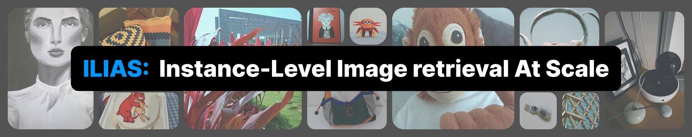

<p align="center">

</p>

**ILIAS** is a large-scale test dataset for evaluation on **Instance-Level Image retrieval At Scale**. It is designed to support future research in **image-to-image** and **text-to-image** retrieval for particular objects and serves as a benchmark for evaluating representations of foundation or customized vision and vision-language models, as well as specialized retrieval techniques. 

[ **website**](https://vrg.fel.cvut.cz/ilias/)  |  [ **dataset**](https://vrg.fel.cvut.cz/ilias_data/)  |  [ **arxiv**](https://arxiv.org/abs/2502.11748) | [ **huggingface**](https://huggingface.co/datasets/vrg-prague/mini-ilias)

## Composition
The dataset includes **1,000 object instances** across diverse domains, with:
* **5,947 images** in total:
  * **1,232 image queries**, depicting query objects on clean or uniform background
  * **4,715 positive images**, featuring the query objects in real-world conditions with clutter, occlusions, scale variations, and partial views
* **1,000 text queries**, providing fine-grained textual descriptions of the query objects
* **100M distractors** from YFCC100M to evaluate retrieval performance under large-scale settings, while asserting noise-free ground truth

## Instructions
You can find instructions for downloading ILIAS and relevant code for the various processes related to our benchmark in the links below
* [download ILIAS](download)
* feature extraction (coming soon...)
* kNN search (coming soon...)
* evaluation (coming soon...)
* re-ranking with local representations (coming soon...)
* linear adaptation (coming soon...)

## Citation
If you use ILIAS in your research or find our work helpful, please consider citing our paper and starring this repo
```bibtex
@inproceedings{ilias2025,
  title={{ILIAS}: Instance-Level Image retrieval At Scale},
  author={Kordopatis-Zilos, Giorgos and Stojnić, Vladan and Manko, Anna and Šuma, Pavel and Ypsilantis, Nikolaos-Antonios and Efthymiadis, Nikos and Laskar, Zakaria and Matas, Jiří and Chum, Ondřej and Tolias, Giorgos},
  booktitle={Computer Vision and Pattern Recognition (CVPR)},
  year={2025},
} 
```

## License
The code in this repository is licensed under the MIT License - see the [LICENSE](LICENSE) for details.

## Contact
For more information, inquiries, or further details, please reach out to [Giorgos Kordopatis-Zilos](mailto:kordogeo@fel.cvut.cz)
